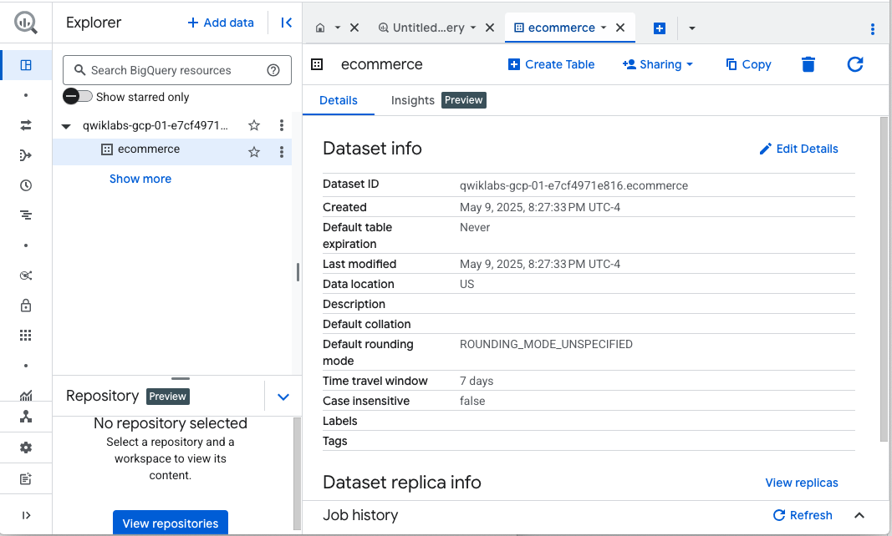
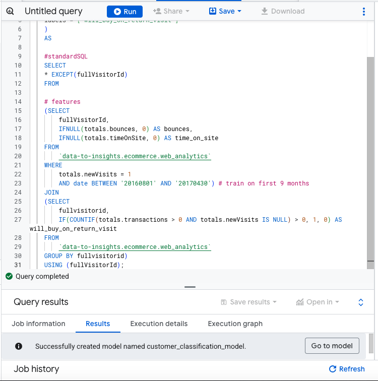
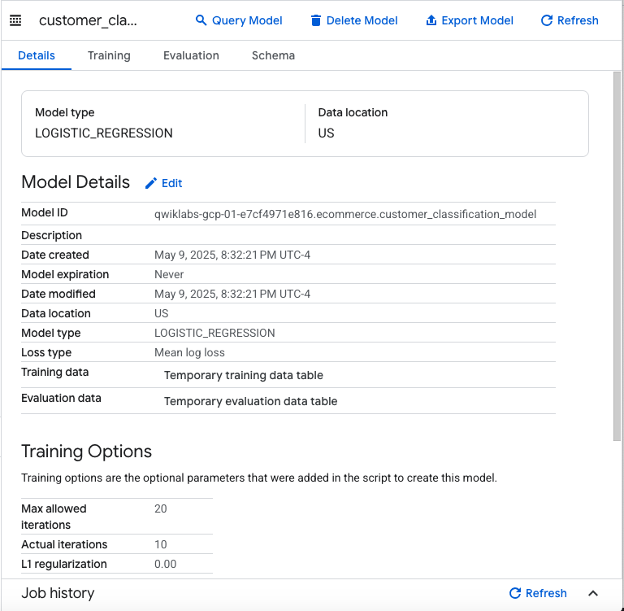
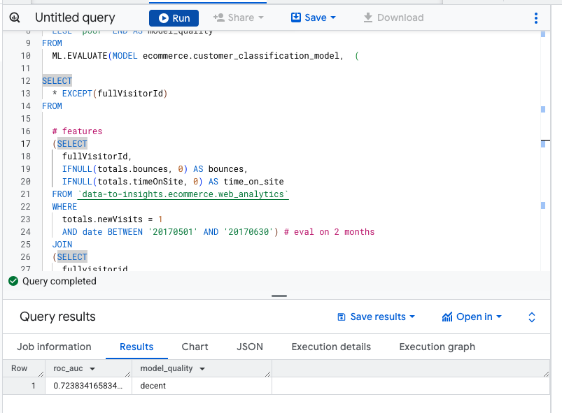
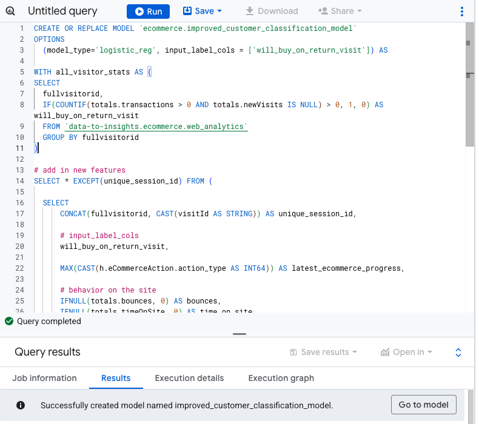
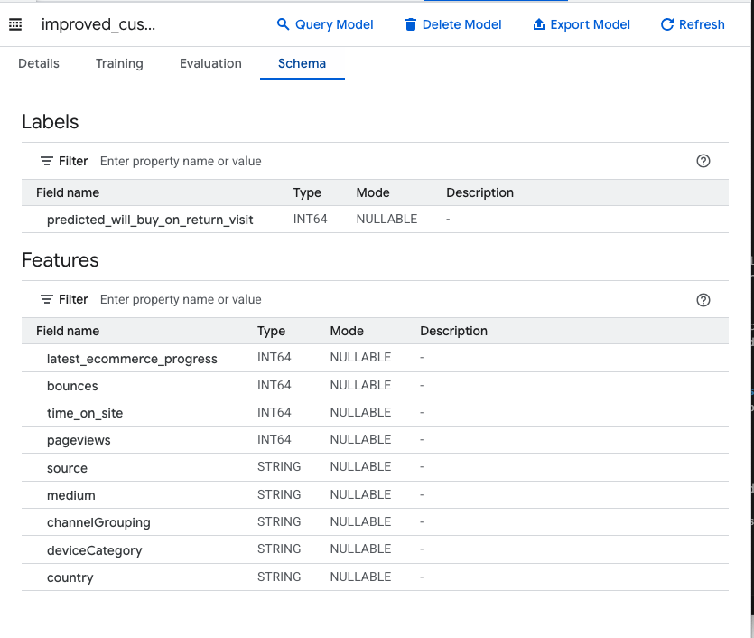
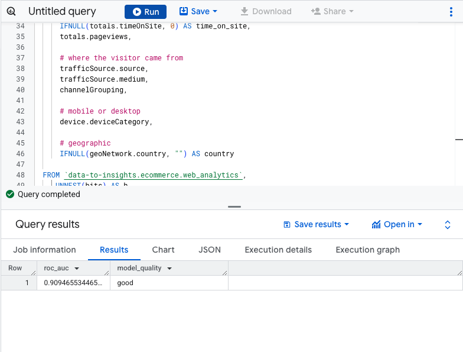
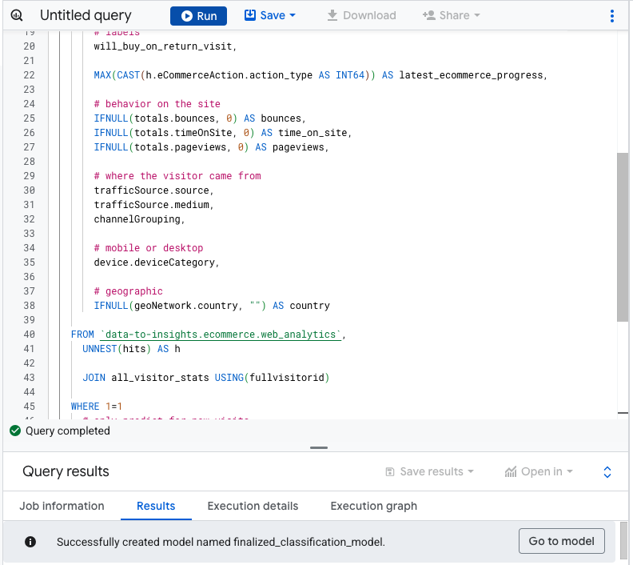
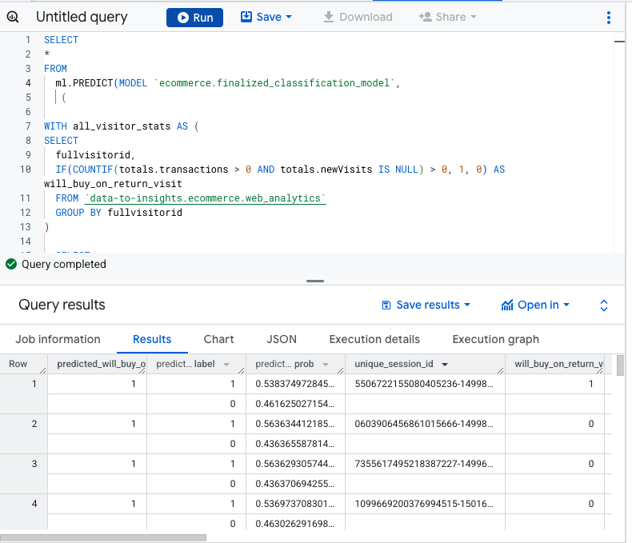

# GCP-Challange-Lab-Create-ML-Models-with-BigQuery-ML
Create ML Models with BigQuery ML

##### Overview
In a challenge lab you’re given a scenario and a set of tasks. Instead of following step-by-step instructions, you will use the skills learned from the labs in the course to figure out how to complete the tasks on your own! An automated scoring system (shown on this page) will provide feedback on whether you have completed your tasks correctly.

When you take a challenge lab, you will not be taught new Google Cloud concepts. You are expected to extend your learned skills, like changing default values and reading and researching error messages to fix your own mistakes.

To score 100% you must successfully complete all tasks within the time period!

This lab is recommended for students who have enrolled in the Create ML Models with BigQuery ML skill badge. Are you ready for the challenge?


##### Challenge scenario
You have started a new role as a junior member of the Data Science department. Your team is working on multiple projects with a number of machine learning initiatives. You are expected to help with the development and assessment of data sets and machine learning models to help provide insights based on real work data sets.

You are expected to have the skills and knowledge for these tasks, so don't expect step-by-step guides to be provided.

The following tasks in this lab check your knowledge related to BigQuery and machine learning.


### Task 1. Create a new dataset and machine learning model
One of the projects you are working on needs to provide analysis based on real-world data. Your role in this project is to develop and evaluate machine learning models.

. So, in this task, you have to create a dataset with the dataset ID ecommerce in which you can store your machine learning models.



. Now create the machine learning model customer_classification_model to predict the performance of the model. Run the following query to create the customer_classification_model.

```
  CREATE OR REPLACE MODEL `ecommerce.customer_classification_model`
    OPTIONS
    (
    model_type='logistic_reg',
    labels = ['will_buy_on_return_visit']
    )
    AS

    #standardSQL
    SELECT
    * EXCEPT(fullVisitorId)
    FROM

    # features
    (SELECT
        fullVisitorId,
        IFNULL(totals.bounces, 0) AS bounces,
        IFNULL(totals.timeOnSite, 0) AS time_on_site
    FROM
        `data-to-insights.ecommerce.web_analytics`
    WHERE
        totals.newVisits = 1
        AND date BETWEEN '20160801' AND '20170430') # train on first 9 months
    JOIN
    (SELECT
        fullvisitorid,
        IF(COUNTIF(totals.transactions > 0 AND totals.newVisits IS NULL) > 0, 1, 0) AS will_buy_on_return_visit
    FROM
        `data-to-insights.ecommerce.web_analytics`
    GROUP BY fullvisitorid)
    USING (fullVisitorId);

```





### Task 2. Evaluate classification model performance
In this task, you have to evaluate the performance of the customer_classification_model against new unseen evaluation data.

In BigQuery ML, roc_auc is simply a queryable field when evaluating your trained ML model. So run the query to evaluate how well the model performs using ML.EVALUATE.

```
SELECT
  roc_auc,
  CASE
    WHEN roc_auc > .9 THEN 'good'
    WHEN roc_auc > .8 THEN 'fair'
    WHEN roc_auc > .7 THEN 'decent'
    WHEN roc_auc > .6 THEN 'not great'
  ELSE 'poor' END AS model_quality
FROM
  ML.EVALUATE(MODEL ecommerce.customer_classification_model,  (

SELECT
  * EXCEPT(fullVisitorId)
FROM

  # features
  (SELECT
    fullVisitorId,
    IFNULL(totals.bounces, 0) AS bounces,
    IFNULL(totals.timeOnSite, 0) AS time_on_site
  FROM `data-to-insights.ecommerce.web_analytics`
  WHERE
    totals.newVisits = 1
    AND date BETWEEN '20170501' AND '20170630') # eval on 2 months
  JOIN
  (SELECT
    fullvisitorid,
    IF(COUNTIF(totals.transactions > 0 AND totals.newVisits IS NULL) > 0, 1, 0) AS will_buy_on_return_visit
  FROM
      `data-to-insights.ecommerce.web_analytics`
  GROUP BY fullvisitorid)
  USING (fullVisitorId)

));

```


After evaluating your model, observe the predictive power of this model.


### Task 3. Improve model performance with Feature Engineering and Evaluate the model to see if there is better predictive power
In this task, use dataset features that may help the customer_classification_model model better understand the relationship between a visitor's first session and the likelihood that they purchase on a subsequent visit.

Now add some new features and create a second machine learning model called improved_customer_classification_model.

```
CREATE OR REPLACE MODEL `ecommerce.improved_customer_classification_model`
OPTIONS
  (model_type='logistic_reg', input_label_cols = ['will_buy_on_return_visit']) AS

WITH all_visitor_stats AS (
SELECT
  fullvisitorid,
  IF(COUNTIF(totals.transactions > 0 AND totals.newVisits IS NULL) > 0, 1, 0) AS will_buy_on_return_visit
  FROM `data-to-insights.ecommerce.web_analytics`
  GROUP BY fullvisitorid
)

# add in new features
SELECT * EXCEPT(unique_session_id) FROM (

  SELECT
      CONCAT(fullvisitorid, CAST(visitId AS STRING)) AS unique_session_id,

      # input_label_cols
      will_buy_on_return_visit,

      MAX(CAST(h.eCommerceAction.action_type AS INT64)) AS latest_ecommerce_progress,

      # behavior on the site
      IFNULL(totals.bounces, 0) AS bounces,
      IFNULL(totals.timeOnSite, 0) AS time_on_site,
      IFNULL(totals.pageviews, 0) AS pageviews,

      # where the visitor came from
      trafficSource.source,
      trafficSource.medium,
      channelGrouping,

      # mobile or desktop
      device.deviceCategory,

      # geographic
      IFNULL(geoNetwork.country, "") AS country

  FROM `data-to-insights.ecommerce.web_analytics`,
     UNNEST(hits) AS h

    JOIN all_visitor_stats USING(fullvisitorid)

  WHERE 1=1
    # only predict for new visits
    AND totals.newVisits = 1
    AND date BETWEEN '20160801' AND '20170430' # train 9 months

  GROUP BY
  unique_session_id,
  will_buy_on_return_visit,
  bounces,
  time_on_site,
  totals.pageviews,
  trafficSource.source,
  trafficSource.medium,
  channelGrouping,
  device.deviceCategory,
  country
);

```



How far the visitor got in the checkout process on their first visit
Where the visitor came from(traffic source: organic search, referring site, etc..)
Device category(mobile, tablet, desktop)
Geographic information(country)
Now, evaluate the newly created model improved_customer_classification_model to see if there is better predictive power than customer_classification_model.

```
#standardSQL
SELECT
  roc_auc,
  CASE
    WHEN roc_auc > .9 THEN 'good'
    WHEN roc_auc > .8 THEN 'fair'
    WHEN roc_auc > .7 THEN 'decent'
    WHEN roc_auc > .6 THEN 'not great'
  ELSE 'poor' END AS model_quality
FROM
  ML.EVALUATE(MODEL ecommerce.improved_customer_classification_model,  (

WITH all_visitor_stats AS (
SELECT
  fullvisitorid,
  IF(COUNTIF(totals.transactions > 0 AND totals.newVisits IS NULL) > 0, 1, 0) AS will_buy_on_return_visit
  FROM `data-to-insights.ecommerce.web_analytics`
  GROUP BY fullvisitorid
)

# add in new features
SELECT * EXCEPT(unique_session_id) FROM (

  SELECT
      CONCAT(fullvisitorid, CAST(visitId AS STRING)) AS unique_session_id,

      # input_label_cols
      will_buy_on_return_visit,

      MAX(CAST(h.eCommerceAction.action_type AS INT64)) AS latest_ecommerce_progress,

      # behavior on the site
      IFNULL(totals.bounces, 0) AS bounces,
      IFNULL(totals.timeOnSite, 0) AS time_on_site,
      totals.pageviews,

      # where the visitor came from
      trafficSource.source,
      trafficSource.medium,
      channelGrouping,

      # mobile or desktop
      device.deviceCategory,

      # geographic
      IFNULL(geoNetwork.country, "") AS country

  FROM `data-to-insights.ecommerce.web_analytics`,
     UNNEST(hits) AS h

    JOIN all_visitor_stats USING(fullvisitorid)

  WHERE 1=1
    # only predict for new visits
    AND totals.newVisits = 1
    AND date BETWEEN '20170501' AND '20170630' # eval 2 months

  GROUP BY
  unique_session_id,
  will_buy_on_return_visit,
  bounces,
  time_on_site,
  totals.pageviews,
  trafficSource.source,
  trafficSource.medium,
  channelGrouping,
  device.deviceCategory,
  country
)
));

```








### Task 4. Predict which new visitors will come back and purchase
Now create the machine learning model finalized_classification_model to predict the performance of the model. Run the following query to create the finalized_classification_model.

```
  CREATE OR REPLACE MODEL `ecommerce.finalized_classification_model`
  OPTIONS
    (model_type="logistic_reg", labels = ["will_buy_on_return_visit"]) AS

  WITH all_visitor_stats AS (
  SELECT
    fullvisitorid,
    IF(COUNTIF(totals.transactions > 0 AND totals.newVisits IS NULL) > 0, 1, 0) AS will_buy_on_return_visit
    FROM `data-to-insights.ecommerce.web_analytics`
    GROUP BY fullvisitorid
  )

  # add in new features
  SELECT * EXCEPT(unique_session_id) FROM (

    SELECT
        CONCAT(fullvisitorid, CAST(visitId AS STRING)) AS unique_session_id,

        # labels
        will_buy_on_return_visit,

        MAX(CAST(h.eCommerceAction.action_type AS INT64)) AS latest_ecommerce_progress,

        # behavior on the site
        IFNULL(totals.bounces, 0) AS bounces,
        IFNULL(totals.timeOnSite, 0) AS time_on_site,
        IFNULL(totals.pageviews, 0) AS pageviews,

        # where the visitor came from
        trafficSource.source,
        trafficSource.medium,
        channelGrouping,

        # mobile or desktop
        device.deviceCategory,

        # geographic
        IFNULL(geoNetwork.country, "") AS country

    FROM `data-to-insights.ecommerce.web_analytics`,
      UNNEST(hits) AS h

      JOIN all_visitor_stats USING(fullvisitorid)

    WHERE 1=1
      # only predict for new visits
      AND totals.newVisits = 1
      AND date BETWEEN "20160801" AND "20170430" # train 9 months

    GROUP BY
    unique_session_id,
    will_buy_on_return_visit,
    bounces,
    time_on_site,
    totals.pageviews,
    trafficSource.source,
    trafficSource.medium,
    channelGrouping,
    device.deviceCategory,
    country
  );

```



1. Write a query to predict which new visitors will come back and make a purchase.




2. The query uses the finalized_classification_model model to predict the probability that a first-time visitor to the Google Merchandise Store will make a purchase on a later visit.

3. You have to make the predictions in the last 1 month (out of 12 months) of the dataset.


###### Congratulations!
You have created ML Models with BigQuery ML!
